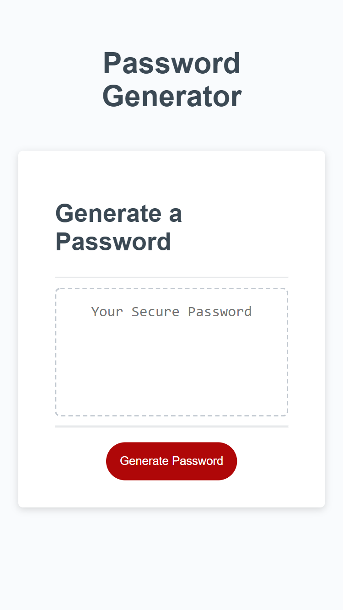

# Module 3 Challenge

## Password Generator

### Use this App to Create a Random Password

This password generator was built using JavaScript.
When the 'Generate Password' button is pressed,
the user will be prompted to give the app certain criteria to build a random password.
Their random password will be displayed in the box.

The user input is validated to only accept a password length between 8 and 128 characters. User input is also validated to ensure at least one character type is selected.

### Screenshot of Application

### [Link to Deployed Application](https://rwaynewhite15.github.io/rwhite-challenge-3/)
